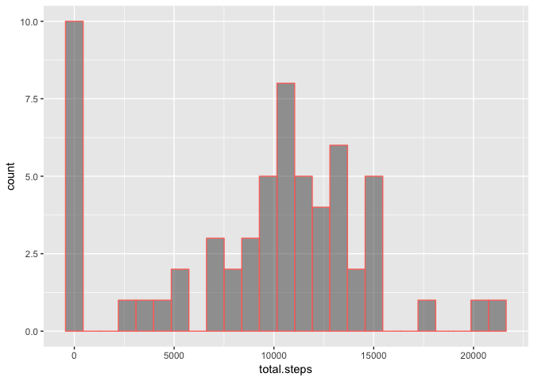
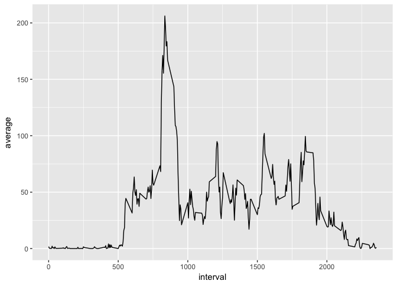
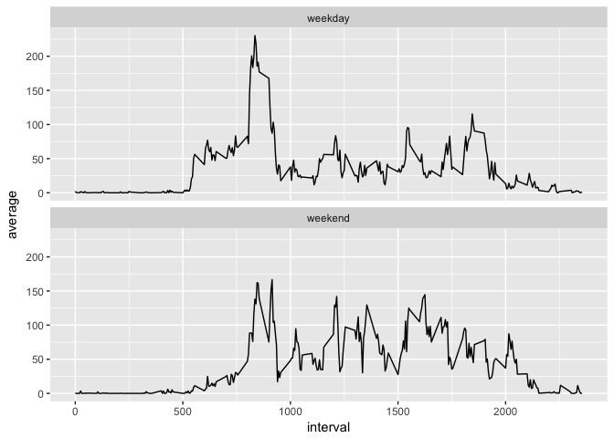

### Summary

The analysis uses the "activity.csv" file containing 17,568 data points
recorded for one subject over 61 days in five minute increments. The
steps detailed below look at the data in terms of the number of steps
recorded per day and well as the average number of steps across days for
each specific time interval.

A strategy is proposed to impute the missing data. Histograms and time
series plots show the data both before and after this strategy was
implemented. An analysis of the number of steps as a function of the
time of day for weekdays and weekends side by side, seems to indicate
that the level of activity on weekends is more uniform whereas during
weekdays the activity sikes in the morning.

### Step 1:

Install required packages.

    install.packages("dplyr", repos = "http://cran.us.r-project.org")

    ## 
    ## The downloaded binary packages are in
    ##  /var/folders/mb/d1x7nr6j5qndjlhrk_6t76q40000gn/T//RtmpzK28CZ/downloaded_packages

    library(dplyr)

    ## 
    ## Attaching package: 'dplyr'

    ## The following objects are masked from 'package:stats':
    ## 
    ##     filter, lag

    ## The following objects are masked from 'package:base':
    ## 
    ##     intersect, setdiff, setequal, union

    install.packages("ggplot2",repos = "http://cran.us.r-project.org")

    ## 
    ## The downloaded binary packages are in
    ##  /var/folders/mb/d1x7nr6j5qndjlhrk_6t76q40000gn/T//RtmpzK28CZ/downloaded_packages

    library(ggplot2)

### Step 2:

Read the data and clean up a bit. The cleanup includes setting the Date
type for the 'date' field and adding a column for the day of the week on
which the data was recorded.

    dataSet<-read.csv("activity.csv")
    dataSet$date<-as.Date(dataSet$date)
    week_day<-weekdays(dataSet$date)
    week_day[week_day=="Sunday"| week_day=="Saturday"]<-"weekend"
    week_day[week_day!="weekend"]<-"weekday"
    week_day<-as.factor(week_day)
    dataSet<-cbind(dataSet, week_day)

### Step 3:

Calculate total number of daily steps and construct a histogram. Then
calculate the mean and median.

    dataSetByDay<-group_by(dataSet, date)
    totalByDay<-as.data.frame(summarize(dataSetByDay, 
                total.steps=sum(steps, na.rm=TRUE)))
    ggplot(totalByDay, aes(total.steps))+geom_histogram(bins=25, 
            aes(color="yellow", alpha=0.0))+
        theme(legend.position="none")

    mean<-mean(totalByDay$total.steps)
    mean<-format(mean, nsmall=1, big.mark = ",")

    median<-median(totalByDay$total.steps)
    median<-format(median, big.mark = ",")

The results are mean=9,354.23 and median=10,395. Both numbers are
shifted downwards by the fact that missing values don't contribute to
the statistics. We'll address this later on when we find a sensible
strategy to impute the missing values.

### Step 4:

Summarize the data by time interval by calculating an average over all
dates for each time interval; there are 288 such intervals for each day.

    dataSetGroup<-group_by(dataSet, interval)
    dataSetByInterval<-as.data.frame(dplyr::summarize(dataSetGroup, 
                        average=mean(steps, na.rm=TRUE)))

    ggplot(dataSetByInterval, aes(interval, average))+geom_line()

    result<-dataSetByInterval[which.max(dataSetByInterval$average),]
    maxSteps<-result$steps
    maxInterval<-result$interval
    print(result)

    ##     interval  average
    ## 104      835 206.1698

The maximum occurs at interval 835. This is at some point in the
morning, likely when the subject walks to work or has their morning
workout.

### Step 5:

Do a brief analysis of the missing data. Look for missing data, both
overall and on a day by day basis.

    missingValues<-colSums(is.na(dataSet))
    print(missingValues)

    ##    steps     date interval week_day 
    ##     2304        0        0        0

    missingValues<-missingValues[1]
    missingValues<-format(missingValues, big.mark="," )
    dataSetGroup<-group_by(dataSet, date)
    breakdown<-as.data.frame(dplyr::summarize(dataSetGroup,count=sum(is.na(steps))))
    breakdown<-breakdown[breakdown$count>0,]
    day<-weekdays(breakdown$date)
    breakdown<-cbind(breakdown, day)
    print(breakdown)

    ##          date count       day
    ## 1  2012-10-01   288    Monday
    ## 8  2012-10-08   288    Monday
    ## 32 2012-11-01   288  Thursday
    ## 35 2012-11-04   288    Sunday
    ## 40 2012-11-09   288    Friday
    ## 41 2012-11-10   288  Saturday
    ## 45 2012-11-14   288 Wednesday
    ## 61 2012-11-30   288    Friday

We find that there are 2,304 missing values. Upon closer inspection, it
turns out that there are a few days for which the data is missing
completely. If data exists for part of the day, it's there for the
entire day. A reasonable explanation is that on the dates where data is
missing the subject was simply not wearing the device.

### Step 6:

Apply a strategy to impute missing values. We chose to replace a missing
value for a specific time interval during the day with an average of
steps recorded across all the dates for which data was available for
that particular time interval. This makes sense as there appears to be a
dependency between the number of steps and the time of the day when they
were recorded.

    for(i in 1:nrow(dataSet))
    {
        if(is.na(dataSet$steps[i])) dataSet$steps[i]<-
                as.integer(dataSetByInterval$average[match(dataSet$interval[i], 
                dataSetByInterval$interval)])
    }

    dataSetByDay<-group_by(dataSet, date)
    totalByDay<-as.data.frame(summarize(dataSetByDay, 
                             total.steps=sum(steps, na.rm=TRUE)))
    ggplot(totalByDay, aes(total.steps))+geom_histogram(bins=25, 
             aes(color="yellow", alpha=0.0))+
        theme(legend.position = "none")

    newMean<-mean(totalByDay$total.steps)
    newMean<-format(newMean, nsmall=2, big.mark = ",")
    newMedian<-median(totalByDay$total.steps)
    newMedian<-format(newMedian, big.mark=",")
    print(newMean)

    ## [1] "10,749.77"

    print(newMedian)

    ## [1] "10,641"

With this strategy applied, we find the new mean to be 10,749.77 and the
new median to be 10,641, up from the original values of 9,354.23 for the
mean and 10,395 for the median when the missing values were simply
ignored. that's because essentially by ignoring NAs we are assuming they
are zero.

The histogram is also changing significantly, as records that were
assumed to be zero before and are now moving to the center of the
figure.

### Step 7:

Generate new time series, broken down by week day and weekend and plot
side by side. This would allow us to see whether the subject's activity
is a function of whether the data records come from a weekend or a week
day.

    dataSetGroup<-group_by(dataSet, week_day)
    totalByWeekDay<-as.data.frame(summarize(dataSetGroup, total<-sum(steps)))

    dataSetGroup<-group_by(dataSet, interval, week_day)
    dataSetByInterval<-as.data.frame(dplyr::summarize(dataSetGroup, 
                                    average=mean(steps, na.rm=TRUE)))
    ggplot(dataSetByInterval, aes(interval, average))+geom_line()+
        facet_wrap(~week_day, ncol=1)

The results show a more uniform distribution of activity across time
during weekend days. The spike during weekdays could be attributed to
either a morning workout (which doesn't seem to happen on weekends) or
possibly the subject walking to work in the morning.
